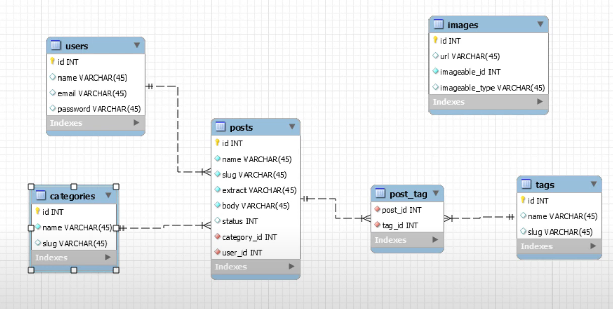

## 1. Diseño de la base de datos

<h2>Seeders y Factory</h2>
Para las imágenes, 
<?php

namespace Database\Factories;

use Illuminate\Database\Eloquent\Factories\Factory;
use App\Models\Image;
/**
 * @extends \Illuminate\Database\Eloquent\Factories\Factory<\App\Models\Image>
 */
class ImageFactory extends Factory
{
    /**
     * Define the model's default state.
     *
     * @return array<string, mixed>
     */
    protected $model = Image::class;
    public function definition(): array
    {
        return [
            'url' => 'posts/'. $this->faker->image('storage/app/posts', 640, 480, null, false)
        ];
    }
}
Creamos un factory que nos crea una url a partir del directorio donde queremos generar las imagenes. Queremos guardarlas en una carpeta post que no existe y con factory no podemos crear directorios. Necesitamos utilizar en el Seeder, Storage:
use Illuminate\Support\Facades\Storage;
Y dentro de la función run añadir
Storage::makeDirectory('posts');

## Learning Laravel

## Laravel Sponsors

### Premium Partners

## Contributing

Thank you for considering contributing to the Laravel framework! The contribution guide can be found in the [Laravel documentation](https://laravel.com/docs/contributions).

## Code of Conduct

In order to ensure that the Laravel community is welcoming to all, please review and abide by the [Code of Conduct](https://laravel.com/docs/contributions#code-of-conduct).

## Security Vulnerabilities

If you discover a security vulnerability within Laravel, please send an e-mail to Taylor Otwell via [taylor@laravel.com](mailto:taylor@laravel.com). All security vulnerabilities will be promptly addressed.

## License

The Laravel framework is open-sourced software licensed under the [MIT license](https://opensource.org/licenses/MIT).
